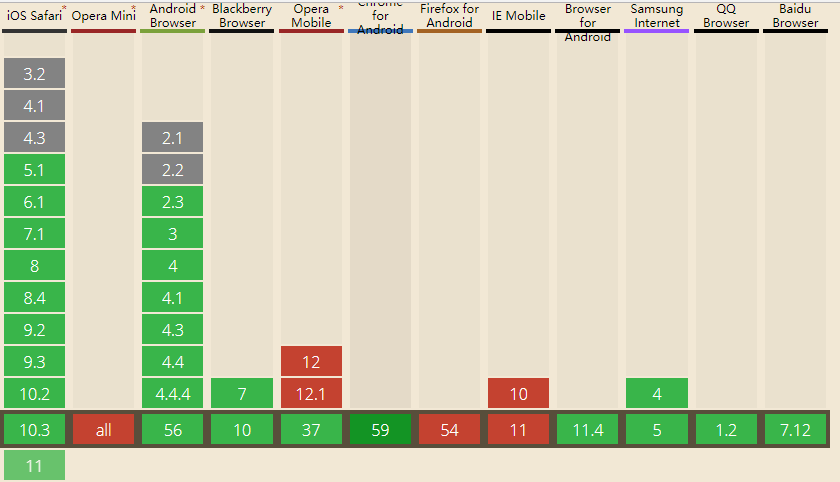
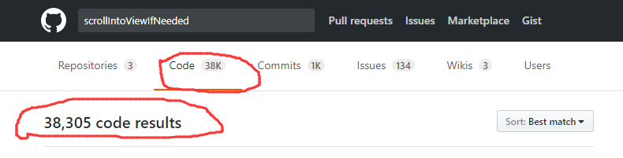

# #0 缘起

前一阵有人在微信群里面遇到了一个问题：

> 当输入框在最底部的时候，弹起的虚拟键盘会把输入框挡住。

于是我发给他一个 API：`Element.scrollIntoViewIfNeeded(opt_center)`，顾名思义，就是在需要的时候将元素滚动到可视区域。

对于前端 API 来说，我们最关心的是它的浏览器兼容性：

随后他又问我：

> 怎么样才能学到这些新的前端技术和API？

首先要知道，这并不是一个新的 API，我们看看它的支持情况:

- 2010-12-06 发布的 Android 2.3（6年前）
- 2011-06-20 发布的 Safari 5.1
- 2011-09-16 发布的 Chrome 15
- 2012-03-07 发布的 iOS 5.1
- ...

这已经是一个有着 6 年历史的 API 了。如果在 GitHub 搜索一下，可以搜索到 38,305 个搜索结果。

这已经是一个被广泛使用的 API 了。

所以我创建了这个 repo，整理一些比较实用的但是却不经常见的前端技术。

## 建议

关于碎片化阅读其实我是持反对意见的，碎片化阅读只能作为自己知识的补充，但是真正想学好前端，还是应该多看书，从头构建自己的**完整知识体系**，然后把碎片化阅读作为自己知识体系中知识点的补充。

## 方式

最初本 repo 所有的讨论都是以 [issues](https://github.com/justjavac/the-front-end-knowledge-you-may-dont-know/issues) 的形式进行，任何人都可以在 issues 区围观讨论。我先创建了 2 个 issue（须知 [#1](https://github.com/justjavac/the-front-end-knowledge-you-may-dont-know/issues/1)
、索引 [#2](https://github.com/justjavac/the-front-end-knowledge-you-may-dont-know/issues/2)），于是这个 repo 就建起来了。

后来有人提议将文章用 md 格式来写，issue 用于讨论 [#17](https://github.com/justjavac/the-front-end-knowledge-you-may-not-know/issues/17)。
